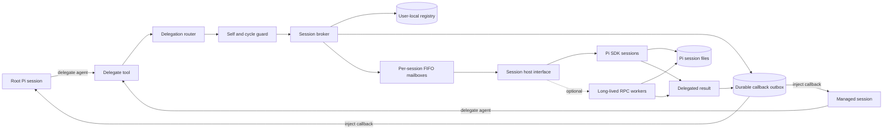
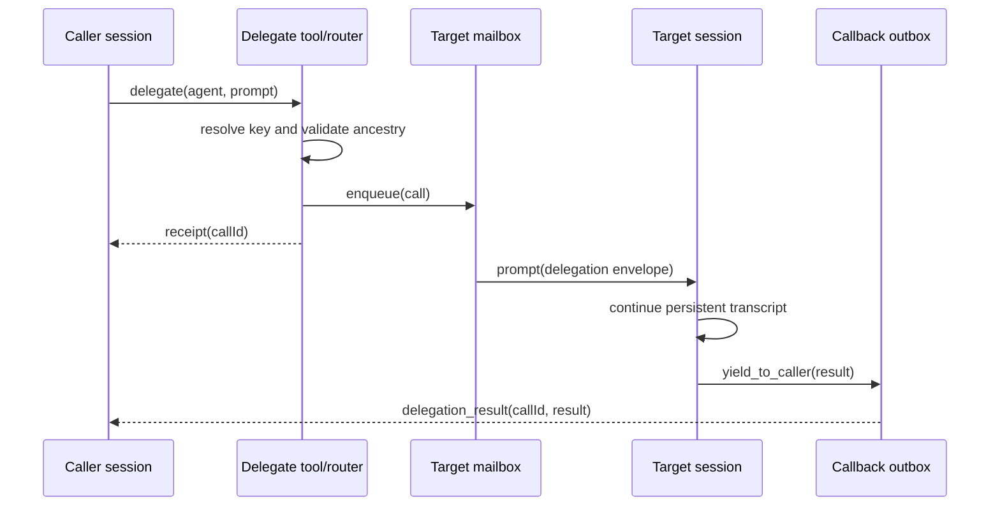

# Architecture

## 1. Goal

Provide a Pi tool such as `delegate({ agent, prompt })`. Agent names are dynamic
profiles; `research`, `plan`, and `code` are examples. Repeated calls to one
agent resolve to the same durable conversation for the current project and OS
user, including after the host process restarts.

Delegation is asynchronous. The call immediately returns a durable receipt. When
the delegated turn settles, the extension injects a correlated callback message
into the immediate caller's chat without destroying either session.

The design also allows a managed session to call another agent. Calling its own
agent queues a follow-up on that same session; it does not create a child.

## 2. Terminology

- **Root session**: the interactive Pi conversation in which the user starts.
- **Agent profile**: a user-defined name, instructions, model policy, and tool
  policy. `research`, `plan`, and `code` are only examples.
- **Managed session**: a durable Pi conversation assigned to one session key.
- **Delegated call**: one request from a caller session to a target managed
  session.
- **Receipt**: the durable call ID returned immediately to the caller.
- **Callback**: a later `delegation_result` message injected into the caller's
  chat.
- **Turn**: one accepted prompt and its complete agent run. A turn finishing does
  not mean that its managed session is deleted.
- **Broker**: the extension component that resolves identities, queues turns,
  hosts sessions, and routes results.

## 3. Requirements

### Functional

1. Any configured agent profile is callable from the root and managed sessions.
2. Repeated calls with the same session key use the same transcript.
3. Session identity survives host restarts and reopens the exact Pi session.
4. Delegation returns a receipt without blocking the caller.
5. A delegated result later appears as a correlated callback in the immediate
  caller's chat.
6. Different managed sessions may call each other.
7. A same-session call queues a local follow-up and never creates a new session.
8. Calls to one busy session queue in FIFO order.
9. Cancellation, timeout, crash, and cycle failures produce callback results.
10. Agent-specific model, prompt, and tool permissions are configurable.

### Non-functional

- No more than one ordinary active prompt per managed session.
- Registry and callback-outbox writes are atomic and recoverable.
- Full results remain available when model-visible output is truncated.
- The broker emits correlated, content-safe operational logs.
- The session backend can later change from SDK to RPC without changing tools.
- No session connection or transcript metadata is stored in the project tree.

## 4. Assumed MVP semantics

These choices allow implementation to start, but remain product decisions:

- Session key scope is local user, canonical project identity, and agent name.
- Persistence includes host restarts, not only repeated calls in one process.
- Delegation is fire-and-forget and returns a receipt.
- Results are injected into the immediate caller's chat and trigger a new turn.
- Calls to one agent queue FIFO.
- Cross-agent causal cycles are rejected; same-agent calls become follow-ups.
- Workers close after an idle period but their session files remain durable.
- Tool permissions come from each dynamic agent profile.
- Sessions share the project working tree; write-capable turns are serialized.

## 5. System overview



## 6. Components

### Extension entry point

Registers:

- `delegate({ agent, prompt })` for every caller.
- `yield_to_caller`, available only inside managed sessions.
- Administrative commands to list, inspect, reset, and stop managed sessions.
- Lifecycle hooks that flush registry state and dispose live hosts.

Optional named tool aliases may be generated for selected profiles, but the
single dynamic tool is the stable API and does not require extension reload when
a profile is added.

### Delegation router

The router:

1. Resolves the requested agent profile and target session key.
2. Compares it with the caller's concrete session key.
3. Turns a same-key call into a local follow-up.
4. Rejects a repeated non-local key in the causal ancestry.
5. Atomically creates a call record and callback destination.
6. Enqueues it in the target mailbox.
7. Immediately returns the call receipt.
8. On settlement, writes a callback to the outbox and delivers it when the
  caller session can accept it.

### Session broker

The broker owns live session handles. It lazily opens the exact session file in
the registry or creates and names a new persistent session. It is the only
component allowed to prompt or dispose a managed session.

### Mailbox

Each session key has one FIFO. At most one ordinary `prompt()` runs at a time.
This is required because Pi rejects an unqualified second prompt while a session
is streaming. Steering and follow-up are separate future policies, not the
default delegation path.

### Durable registry

The registry maps stable keys to exact Pi session identities. It is user-local
extension state, not model context and not a project file. A suitable default is
an extension-owned directory below the current OS user's Pi data directory,
with a configurable override. Separate OS users therefore get separate mappings
for the same checkout. A minimal record is:

```ts
interface SessionRecord {
  schemaVersion: 1;
  sessionKey: string;
  projectId: string;
  agentName: string;
  sessionId: string;
  sessionPath: string;
  displayName: string;
  configFingerprint: string;
  createdAt: string;
  lastUsedAt: string;
}
```

Write the registry through a temporary file and atomic rename. On startup,
validate paths and IDs before opening sessions. Missing or corrupt records are
quarantined rather than silently mapped to a different conversation.

Agent profile definitions may be user-local or project-declared. Project files
may describe shareable names and policies, but never contain user session IDs,
session paths, call receipts, or callback state. Project-declared profiles are
repository-controlled policy and require trust.

### Durable calls and callback outbox

Fire-and-forget requires durable delivery state separate from the transcript:

```ts
interface CallRecord {
  callId: string;
  status: "queued" | "running" | "settled" | "delivered";
  targetSessionKey: string;
  caller: CallerAddress;
  createdAt: string;
  settledAt?: string;
  resultArtifact?: string;
}

interface CallerAddress {
  kind: "root" | "managed";
  sessionId: string;
  sessionPath?: string;
  sessionKey?: string;
}
```

Settlement and outbox creation must be atomic from the broker's perspective.
Delivery is at-least-once, so callback messages carry `callId` and the caller
deduplicates them. A closed caller keeps a pending outbox item until that exact
session is attached again.

### Session host interface

```ts
interface SessionHost {
  open(record: SessionRecord): Promise<ManagedSession>;
  create(spec: NewSessionSpec): Promise<ManagedSession>;
  runTurn(session: ManagedSession, call: DelegationCall): Promise<TurnResult>;
  abort(session: ManagedSession, callId: string): Promise<void>;
  close(session: ManagedSession): Promise<void>;
}
```

The MVP implementation uses independently created Pi `AgentSession` objects.
An RPC implementation can later map the same interface to one long-lived
process per live session.

## 7. Identity and routing

### Session key

The tentative key is:

```text
v1:<local-user-scope>:<canonical-project-id>:<agent-name>
```

`canonical-project-id` should use the repository root's normalized real path and
Git identity where available. Never use only a display name. The user scope is
normally implicit in the user-local state directory; include an installation ID
in records to prevent accidental state-directory sharing.

The agent name is not the top-level task description. If parallel independent
tasks must have isolated histories, add an explicit namespace:

```text
v1:<local-user-scope>:<canonical-project-id>:<task-namespace>:<agent-name>
```

Do not infer this namespace from prompt text.

### Call envelope

```ts
interface DelegationCall {
  callId: string;
  rootCallId: string;
  callerSessionKey: string;
  callerAgent: "root" | string;
  targetSessionKey: string;
  targetAgent: string;
  ancestry: string[];
  depth: number;
  prompt: string;
  createdAt: string;
}

interface TurnResult {
  callId: string;
  sourceSessionKey: string;
  status: "completed" | "failed" | "cancelled" | "cycle_rejected";
  content: string;
  artifacts?: Array<{ name: string; path: string }>;
  completedAt: string;
}

interface DelegationReceipt {
  callId: string;
  targetAgent: string;
  status: "queued";
}
```

`ancestry` contains causal session keys, not merely agent names. It prevents
automatic callback chains from looping across existing sessions. The same-key
case is handled first and becomes a follow-up rather than a cycle error.

## 8. Delegation behavior

### Normal cross-agent call



The managed prompt tells the target to finish by calling `yield_to_caller`.
That tool captures a typed result for the active call. If the model finishes
without calling it, the broker uses the final assistant text as a fallback and
records a protocol warning; it must not hang indefinitely.

A target that is missing information only the caller or user can supply calls
`ask_caller(question)` instead of guessing. The call settles as `needs_input`
(terminal for that call) and the caller receives a `delegation_question`
callback instructing it to answer — directly or by asking the user — and then
send the answer with a new `delegate` call. Because sessions are persistent,
the target continues in the same transcript with full context.

The callback is a custom `delegation_result` chat message containing `callId`,
source agent, status, summary, and artifact references. Delivery triggers a new
agent turn by default, making the answer behave like a new incoming call. If the
caller is busy, delivery uses its follow-up queue. If it is closed, the outbox
waits for that exact session to reopen.

### Nested call

If an `investigator` agent delegates to `architect`, its tool call immediately
gets a receipt and its current turn may finish. The architect's result is later
injected into the investigator chat, triggering a new turn there. The broker
never routes every result directly to the root.

### Same-session call

If the resolved target key equals the caller key, the broker must preserve the
same session. It enqueues the objective using Pi's follow-up mechanism and
returns a receipt. The current turn is not recursively prompted; the follow-up
runs at the next safe turn boundary. No new session is created.

The immediate tool result can be:

```json
{
  "kind": "local_follow_up",
  "callId": "call_123",
  "agent": "investigator",
  "status": "queued"
}
```

The follow-up result is appended to the same transcript. It does not need a
callback into itself because the result is already in the target caller's chat.

### Cross-agent cycle

Asynchronous calls do not create a wait deadlock, but automatic callbacks can
create an unbounded agent loop. If `investigator -> architect -> investigator`
reaches an investigator key already in causal ancestry, reject it and deliver a
`cycle_rejected` callback. The direct same-key case remains the explicit local
follow-up exception. Also enforce a maximum causal depth and per-root-call
delegation budget.

## 9. Completion and callbacks

“Session finishes” means the delegated turn settles; the persistent managed
session remains addressable.

For SDK hosting, completion is the resolved `session.prompt()` plus the captured
`yield_to_caller` payload. For RPC hosting, prompt acceptance is not completion;
wait for Pi's `agent_settled` event. `agent_end` alone is insufficient because a
retry, compaction retry, or queued continuation may still follow.

The callback is not the original tool return. The original return is a receipt;
the callback is a later correlated chat message. Durable call records and the
outbox survive extension restart. Conversation identity lives in the user-local
registry and Pi session files.

Pi callback injection must use `triggerTurn: true` with
`deliverAs: "followUp"`. When the caller is idle this starts a model turn
immediately; when it is streaming, Pi queues the callback until that run
settles. Do not use `deliverAs: "nextTurn"` for callbacks: Pi intentionally
ignores `triggerTurn` in that mode and waits for the next user prompt. Reserve
`nextTurn` for passive administrative messages that must not invoke the model.

## 10. Lifecycle and recovery

### Startup

1. Load and validate the registry schema.
2. Reconcile undelivered callback outbox items.
3. Do not eagerly prompt sessions.
4. Reopen a session lazily on its next call or pending callback delivery.
5. Recover stale `running` call records as interrupted; never assume an external
   effect did not happen.

### Normal shutdown

Stop accepting calls, persist queued/running call state and callbacks, allow a
bounded drain, abort remaining turns, then dispose SDK sessions or stop RPC
workers. Closing a live host never deletes its session file.

### Worker failure

- Mark the current call failed or interrupted with diagnostic context.
- Dispose the broken handle.
- Reopen the exact saved session for the next queued call.
- Do not automatically replay write-capable turns unless explicitly declared
  replay-safe.

### Print mode (verified behavior)

In `pi -p` the root process can exit before a delegated turn settles. The
callback then remains pending in the outbox and is delivered on the next
startup of the extension for that project (verified live: settle after root
exit -> `settled` with no `callbackDeliveredAt` -> next run flushes and
confirms). Because Pi's message injection is fire-and-forget, delivery is
confirm-based: a callback is marked delivered only after durable evidence
(the call ID and callback entry type appear in the caller's transcript), with
a cooldown preventing duplicate re-sends while a queue is unconfirmed.

### Configuration drift

Store a fingerprint of the profile prompt, model policy, and tool policy. A changed
fingerprint does not silently reset history. Surface it and apply one configured
policy: continue, fork, or require confirmation.

## 11. Agent profiles

Profiles are data, not a closed TypeScript union. Suggested examples:

| Example | Purpose | Tools |
|---|---|---|
| `research` | Gather evidence and compare alternatives | Read, search, web, delegation |
| `plan` | Produce decisions, architecture, and executable steps | Read, search, delegation |
| `code` | Implement and validate changes | Read, edit, shell, tests, delegation |

Users may add any number of profiles with arbitrary names. All profiles receive
`delegate` and `yield_to_caller`.

### 11.1 Profile layout: single YAML file per scope

All profiles of a scope live in one YAML file, keyed by profile name:

```
<stateDir>/profiles.yaml                  # user scope
<projectRoot>/pi-agents/profiles.yaml     # project scope
```

```yaml
profiles:
  research:
    description: one-line summary shown to callers
    bootstrap: |
      Multiline seed instructions, injected once at session creation.
    model: optional model pattern; "auto" (or unset) mirrors the calling
           agent's model on every delegation
    tools: ["*"]        # [] or ["*"] = unrestricted
```

`bootstrap` is the profile's day-one briefing (YAML block scalar, so it stays
readable multiline Markdown): role, working style, and standing knowledge. It
is sent as the first prompt of a newly created managed session and never
re-sent on later turns — the persistent transcript is the session's memory,
and re-injecting a briefing reads as amnesia and wastes context.

If the bootstrap changes after a session exists, the stored
`configFingerprint` will not match. Policy: keep the existing session, report
the drift in `/subagents inspect`, and require an explicit
`/subagents reset <agent>` to re-bootstrap. Never silently re-inject a changed
briefing into a session that already has memories.

### 11.2 Profile sources and precedence

Precedence: **user > project > built-in defaults**.

- **Built-in defaults (lowest):** profiles shipped in the extension source
  (`DEFAULT_PROFILES` in `profileStore.ts`), currently `research`. A fresh
  install can delegate immediately with no setup.
- **User state dir (default):** `<stateDir>/profiles.yaml`. Always trusted.
- **Project-declared (additive):** `pi-agents/profiles.yaml` in the
  repository. A project may add profiles that do not exist in user state.
  Because these files arrive through the shared checkout, they are untrusted
  executable policy and activate only after a one-time per-project trust
  confirmation.
- A user-state profile with the same name **shadows** a project profile,
  which in turn shadows a built-in default.

### 11.3 Name addressing

The profile name is the addressing handle. `delegate({ agent: "Research" })`,
`" research "`, and `"research"` all normalize (lowercase, trimmed, validated)
to the same profile and therefore the same session key
`v1:<project-id>:<research>`. Names are unique per project, so name-to-session
resolution is a single normalized lookup with no ambiguity. No aliases in MVP.

A read-only `list_agents` tool exposes name, description, and last-used time so
a managed session can discover which agents exist before delegating, instead of
guessing and receiving an unknown-agent error.

## 12. Security

- Apply least-privilege tool allowlists per agent profile.
- Never pass secrets in call envelopes, registry logs, or telemetry.
- Confirm destructive commands and privilege expansion.
- Canonicalize project and session paths before access.
- Treat project-declared prompts and extension code as executable policy.
- Keep user session mappings, outbox payloads, and transcript paths outside the
  project and exclude them from source control by construction.
- Record caller, target, call ID, status, duration, and usage without recording
  prompt or result content by default.

## 13. Output handling

Return concise model-visible results. Apply Pi's established guidance of at
most roughly 50 KB or 2,000 lines to a tool result. If content is larger, save
the full result under extension-managed artifacts and return a summary plus its
path. Truncation must be explicit.

## 14. Administrative surface

Recommended commands:

- `/subagents`: list projects, agents, state, queue depth, and last use.
- `/subagents inspect <agent>`: show the mapped session ID/path and policy.
- `/subagents stop <agent>`: dispose the live host but retain history.
- `/subagents reset <agent>`: require confirmation, archive the old mapping, and
  create a new session.
- `/subagents calls`: show queued, running, and undelivered callbacks.
- `/subagents doctor`: validate registry records and session files.

## 15. Validation strategy

### Unit tests

- Stable key normalization and project isolation.
- User-local mappings never write into the project.
- Same-key calls enqueue a follow-up and create no session.
- Ancestry cycle rejection includes the complete path.
- FIFO ordering and one-active-turn invariant.
- Receipts return before target completion.
- Callback outbox delivery and call-ID deduplication.
- Immediate-caller callback routing for nested calls.
- Registry atomic write, corrupt record, and missing file behavior.
- Dynamic profile discovery, allowlists, and configuration fingerprints.

### Integration tests

- Two calls to one configured agent observe one transcript and session ID.
- A second OS user gets a different local mapping for the same project.
- Restart the extension, reopen the exact managed session, and continue it.
- A call returns its receipt while the target is still running.
- A settled result wakes the immediate caller with `delegation_result`.
- A closed caller receives its pending callback after reopening.
- `investigator -> investigator` runs as a same-session follow-up.
- `investigator -> architect -> investigator` receives a cycle callback.
- Concurrent root calls to one agent serialize.
- Cancellation settles the call with a callback and leaves the agent reusable.
- A model that omits `yield_to_caller` returns its final assistant text.
- An over-limit result is saved and explicitly truncated.

### Backend contract tests

Run the routing tests against a fake host and the SDK host. If an RPC adapter is
added, run the same suite against it and assert completion only after
`agent_settled`.

## 16. Delivery plan

1. Scaffold the extension and dynamic profile definitions.
2. Implement key resolution, registry, and SDK session host.
3. Add durable call receipts, FIFO mailboxes, and the callback outbox.
4. Add `yield_to_caller`, callback injection, self-follow-ups, and cycle guards.
5. Add cancellation, restart delivery, output artifacts, and administration.
6. Harden permissions and complete restart/concurrency integration tests.
7. Evaluate an RPC host only if process isolation is required in practice.

## 17. Explicit non-goals for MVP

- Agent profile creation by the model without user approval.
- Multiple simultaneous turns in one managed session.
- Exactly-once external side effects after a process crash.
- Distributed workers or remote session replication.
- Automatic merging of edits from isolated worktrees.
- Cross-machine callback delivery while the caller session exists only locally.